# Método 1 — Controle de sessão com pendrive USB

Guia para configurar o bloqueio e o desbloqueio automático de uma sessão gráfica no Debian 13 usando `udev`, Bash e `loginctl`.

**Status histórico:** implementação validada no Debian instalado diretamente no SSD, incluindo teste após reinicialização.

> **Estado atual após o Método 02 — Parte 02:** a regra de conexão que solicitava desbloqueio foi comentada. Somente o bloqueio na remoção permanece ativo. Os testes de desbloqueio automático abaixo documentam o experimento original; não devem ser reaplicados sobre a política USB + senha. Consulte a [Parte 02](../metodo-02/README_USB_Token_Metodo_02_Parte_02.md).

Quando usado isoladamente, este método controla uma sessão já iniciada. Ele não autentica o primeiro login e não torna o pendrive obrigatório: a senha continua permitindo entrar e desbloquear a sessão. A política final combinada com PAM é descrita na seção 11.

## 1. Ambiente e comportamento esperado

| Item | Ambiente validado |
| --- | --- |
| Sistema | Debian GNU/Linux 13 (trixie) |
| Instalação | Diretamente no SSD, sem máquina virtual |
| Interface gráfica | GNOME |
| Tipo de sessão | Wayland |
| Gerenciador de login | GDM |
| Usuário | `henrique` |
| Pendrive | SanDisk Cruzer Blade |
| Vendor ID / Product ID | `0781:5567` |
| Número de série | `4C530101421215115090` |

| Evento | Resultado esperado |
| --- | --- |
| Remover o pendrive cadastrado | Bloquear a sessão gráfica de `henrique` |
| Reconectar o pendrive cadastrado | Solicitar o desbloqueio da sessão gráfica |
| Inicializar sem o pendrive | Login convencional continua disponível |

O `udev` identifica o evento e executa o script como root. O script encontra a sessão gráfica do usuário e chama `loginctl`. O ambiente gráfico precisa atender às solicitações de bloqueio e desbloqueio; isso foi confirmado no GNOME deste ambiente.

As capturas estão organizadas cronologicamente e distribuídas junto aos passos correspondentes. A pasta `./images/` deve permanecer ao lado deste README para os caminhos relativos funcionarem no GitHub. Os testes de bloqueio, desbloqueio e persistência foram confirmados durante a configuração; as capturas abaixo registram os comandos e configurações disponíveis.

## 2. Identificar o ambiente e o dispositivo

Conecte o pendrive e execute no terminal da sessão gráfica:

```bash
cat /etc/os-release
whoami
printf 'Desktop: %s\nTipo da sessão: %s\n' "$XDG_CURRENT_DESKTOP" "$XDG_SESSION_TYPE"
systemctl status display-manager --no-pager
lsusb
lsblk -o NAME,TRAN,SIZE,FSTYPE,LABEL,UUID,MOUNTPOINTS
loginctl list-sessions
```


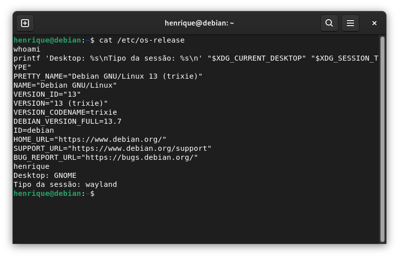

*Figura 1 — Identificação do Debian 13, do usuário henrique e da sessão GNOME com Wayland.*

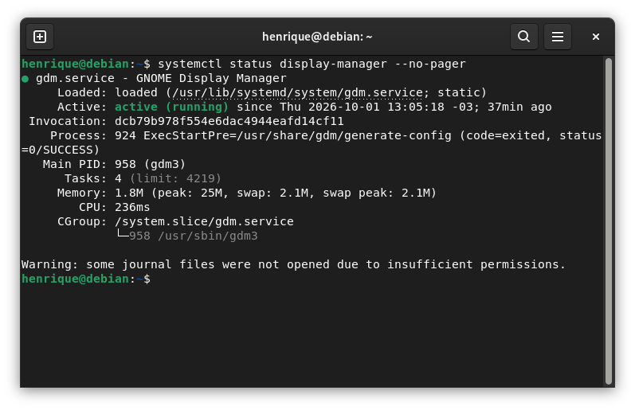

*Figura 2 — GDM ativo como gerenciador de login gráfico.*

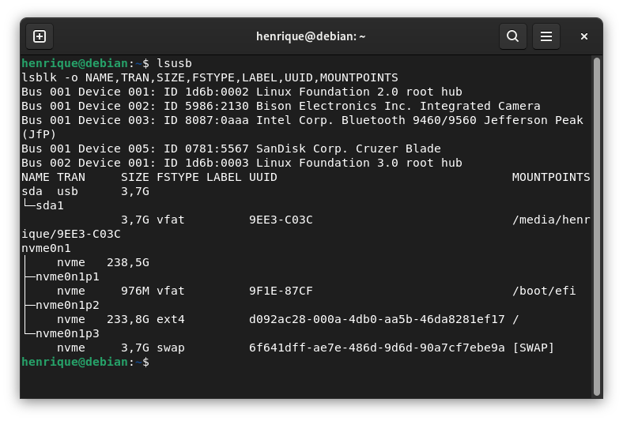

*Figura 3 — Identificação do SanDisk com lsusb e dos discos com lsblk.*

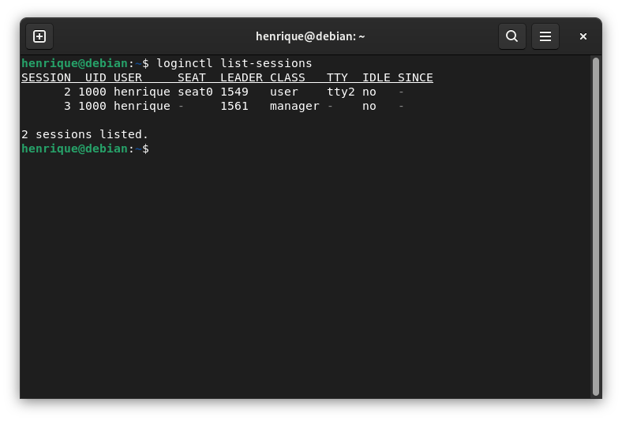

*Figura 4 — Listagem da sessão gráfica e da sessão manager.*

No ambiente validado, `lsusb` mostrou:

```text
ID 0781:5567 SanDisk Corp. Cruzer Blade
```

O disco USB apareceu como `/dev/sda`, com uma partição `/dev/sda1`. **Esse nome pode mudar:** confirme o dispositivo com `lsblk` antes de usar os próximos comandos. Não selecione o disco do sistema.

Consulte as propriedades sem paginação:

```bash
udevadm info --query=property --name=/dev/sda --no-pager
```

Propriedades utilizadas nas regras:

```text
DEVTYPE=disk
ID_BUS=usb
ID_VENDOR_ID=0781
ID_MODEL_ID=5567
ID_SERIAL_SHORT=4C530101421215115090
```


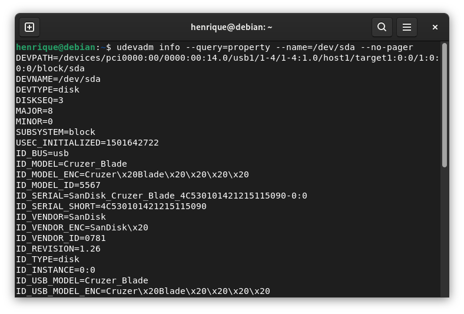

*Figura 5 — Propriedades do disco USB, incluindo fabricante, modelo e serial.*

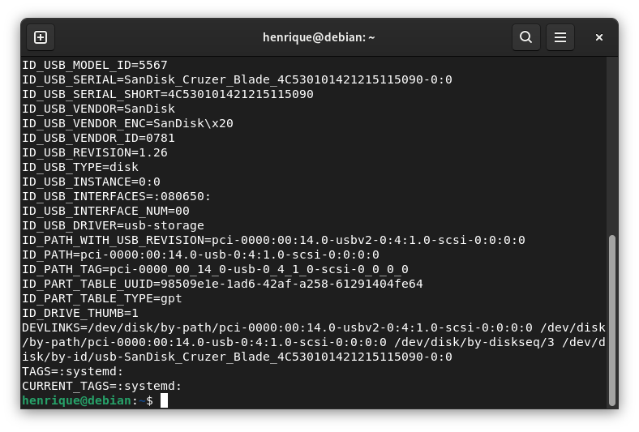

*Figura 6 — Continuação das propriedades USB e dos caminhos associados ao dispositivo.*

Para consultar os atributos do dispositivo e de seus ancestrais:

```bash
udevadm info --attribute-walk --name=/dev/sda --no-pager
```


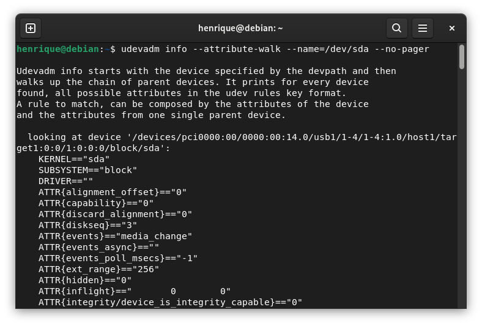

*Figura 7 — Consulta aos atributos do dispositivo com udevadm info --attribute-walk.*

As regras deste guia utilizam as propriedades `ENV{...}` já identificadas, sem depender do nome `/dev/sda`.

> Para reproduzir em outro computador ou com outro pendrive, ajuste o usuário no script e os identificadores nas regras. Não copie o serial deste exemplo para um dispositivo diferente.

## 3. Testar o controle da sessão antes de configurar o USB

Salve os trabalhos abertos. Consulte:

```bash
loginctl list-sessions
```

No teste realizado, havia uma sessão gráfica `2`, do usuário `henrique`, associada a `seat0`, e uma sessão `manager` com ID `3`. A sessão correta era `2`.

Confirme as propriedades, substituindo `2` pelo ID atual da sua sessão gráfica:

```bash
loginctl show-session 2 -p Name -p Seat -p Type -p Class
```


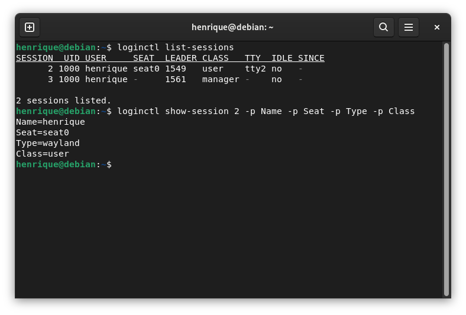

*Figura 8 — Confirmação de Name=henrique, Seat=seat0, Type=wayland e Class=user na sessão 2.*

Execute o teste abaixo, também ajustando o ID nas duas chamadas se necessário:

```bash
sudo -v
(
    sleep 10
    sudo -n loginctl unlock-session 2
) &
sudo -n loginctl lock-session 2
```

No Método 1 isolado, a tela deve bloquear imediatamente e desbloquear após aproximadamente 10 segundos. Se permanecer bloqueada, utilize sua senha normalmente. Com a Parte 02 ativa, o desbloqueio normal exige também o USB; não execute este teste de desbloqueio privilegiado para validar a autenticação PAM.

**Resultado observado:** bloqueio e desbloqueio funcionando.

### Erro encontrado: terminal sem sessão reconhecida

A tentativa inicial com `loginctl lock-session "$XDG_SESSION_ID"` e a chamada correspondente de desbloqueio retornaram:

```text
Failed to issue method call: Caller does not belong to any known session.
```

Nesse teste, o comando não conseguiu resolver a sessão a partir do contexto do terminal. Usar `sudo` e o ID explícito da sessão gráfica resolveu o problema. Não foi necessário alterar o PAM.

O ID explícito é usado apenas neste diagnóstico. O script definitivo identifica a sessão dinamicamente.

## 4. Criar o script de controle

Crie o arquivo:

```bash
sudo nano /usr/local/bin/usb-lock.sh
```

Cole o conteúdo:

```bash
#!/bin/bash

case "${1:-}" in
    lock|unlock) action="$1" ;;
    *) exit 1 ;;
esac

while read -r session_id; do
    name=$(loginctl show-session "$session_id" -p Name --value)
    seat=$(loginctl show-session "$session_id" -p Seat --value)
    type=$(loginctl show-session "$session_id" -p Type --value)

    if [[ "$name" == "henrique" && "$seat" == "seat0" &&
          ( "$type" == "wayland" || "$type" == "x11" ) ]]; then
        loginctl "${action}-session" "$session_id"
    fi
done < <(loginctl list-sessions --no-legend --no-pager | awk '{print $1}')
```


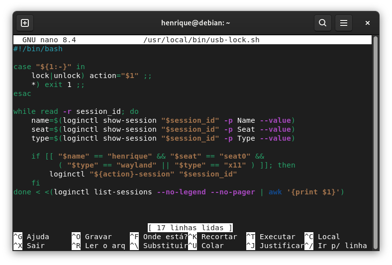

*Figura 9 — Conteúdo do script usb-lock.sh no editor Nano.*

Salve com **Ctrl+O**, confirme com **Enter** e saia com **Ctrl+X**.

O script aceita apenas `lock` ou `unlock` e procura sessões que atendam às três condições:

- Usuário `henrique`.
- Assento `seat0`.
- Tipo `wayland` ou `x11`.

Isso evita selecionar a sessão `manager` e dispensa um ID fixo. Se houver mais de uma sessão correspondente, o comando será enviado a cada uma.

Configure o proprietário e as permissões:

```bash
sudo chown root:root /usr/local/bin/usb-lock.sh
sudo chmod 755 /usr/local/bin/usb-lock.sh
sudo bash -n /usr/local/bin/usb-lock.sh
```

O último comando verifica a sintaxe Bash e não deve produzir mensagem em caso de sucesso.


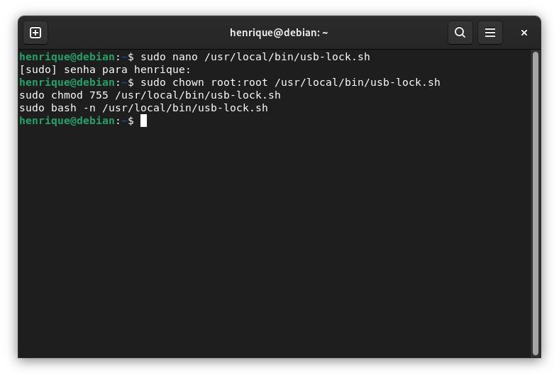

*Figura 10 — Definição do proprietário, das permissões e verificação da sintaxe Bash.*

## 5. Testar o script isoladamente

```bash
sudo -v
(
    sleep 10
    sudo -n /usr/local/bin/usb-lock.sh unlock
) &
sudo -n /usr/local/bin/usb-lock.sh lock
```

**Resultado esperado e observado:** a sessão bloqueia imediatamente e desbloqueia após aproximadamente 10 segundos.

Se esse teste falhar, resolva o problema antes de criar as regras. Assim é possível distinguir problemas no script de problemas na detecção do USB.

## 6. Criar as regras udev do experimento original

Crie o arquivo:

```bash
sudo nano /etc/udev/rules.d/80-usb.rules
```

Cole as duas regras, mantendo cada uma em uma única linha:

```udev
ACTION=="add", SUBSYSTEM=="block", ENV{DEVTYPE}=="disk", ENV{ID_BUS}=="usb", ENV{ID_VENDOR_ID}=="0781", ENV{ID_MODEL_ID}=="5567", ENV{ID_SERIAL_SHORT}=="4C530101421215115090", RUN+="/usr/local/bin/usb-lock.sh unlock"
ACTION=="remove", SUBSYSTEM=="block", ENV{DEVTYPE}=="disk", ENV{ID_BUS}=="usb", ENV{ID_VENDOR_ID}=="0781", ENV{ID_MODEL_ID}=="5567", ENV{ID_SERIAL_SHORT}=="4C530101421215115090", RUN+="/usr/local/bin/usb-lock.sh lock"
```


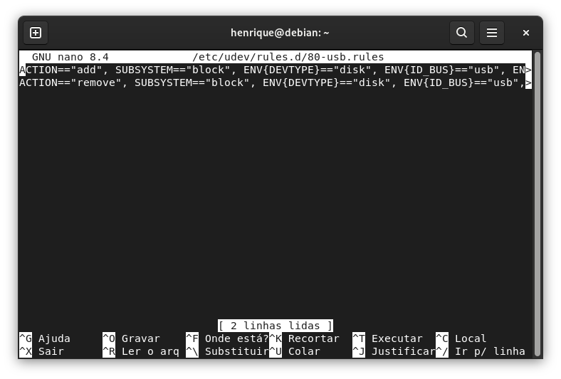

*Figura 11 — Regras de inserção e remoção no Nano; parte das linhas longas fica fora da área visível.*

Salve e saia do editor.

As regras filtram eventos do disco USB, excluindo os eventos das partições por meio de `DEVTYPE=="disk"`. Além do fabricante e do modelo, verificam o serial do pendrive.

Na remoção, as propriedades usadas pela regra vêm do estado do dispositivo mantido pelo `udev`; o teste de remoção confirmou o funcionamento nesse ambiente.

Verifique a sintaxe e recarregue as regras:

```bash
sudo udevadm verify /etc/udev/rules.d/80-usb.rules
sudo udevadm control --reload-rules
```


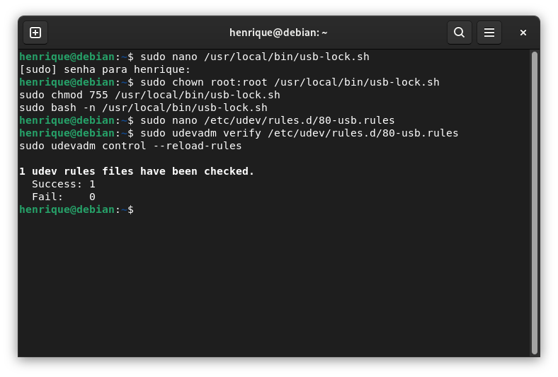

*Figura 12 — Validação das regras com um arquivo aprovado e nenhuma falha, seguida da recarga do udev.*

A recarga aplica a configuração aos próximos eventos. Não é necessário reiniciar para fazer o primeiro teste: retire e reconecte o pendrive.

## 7. Testar com o pendrive

1. Feche arquivos abertos no pendrive e aguarde a conclusão de cópias ou gravações.
2. Desmonte o volume pelo aplicativo Arquivos antes de retirar o dispositivo.
3. Retire fisicamente o pendrive: a sessão deverá bloquear.
4. Reconecte o mesmo pendrive: a sessão deverá desbloquear.

**Resultado observado:** ambos os eventos funcionaram corretamente.

## 8. Validar após reinicialização

1. Reinicie o Debian com o pendrive conectado.
2. Faça login normalmente usando sua senha.
3. Feche os arquivos do pendrive e desmonte seu volume.
4. Retire o pendrive e confirme o bloqueio.
5. Reconecte o pendrive e confirme o desbloqueio.

**Resultado observado:** a configuração continuou funcionando após reiniciar, sem ajustar o ID da sessão.

## 9. Diagnóstico de falhas

| Sintoma | Verificação |
| --- | --- |
| Script não bloqueia a tela | Execute o teste da seção 3 e confira `Name`, `Seat` e `Type` da sessão |
| Script funciona, mas USB não aciona | Confira os identificadores, valide o arquivo de regras e recarregue o `udev` |
| Outro pendrive não desbloqueia | Comportamento esperado: a regra exige o serial cadastrado |
| Funciona antes de reiniciar, mas falha depois | Confira se o script encontra a sessão atual; não fixe um ID no script |
| Propriedades aparecem cortadas | Use `--no-pager` nos comandos `udevadm info` |

Para observar os eventos, abra um terminal e execute:

```bash
sudo udevadm monitor --udev --property --subsystem-match=block
```

Retire e reconecte o pendrive após desmontar o volume. Encerre o monitor com **Ctrl+C**.


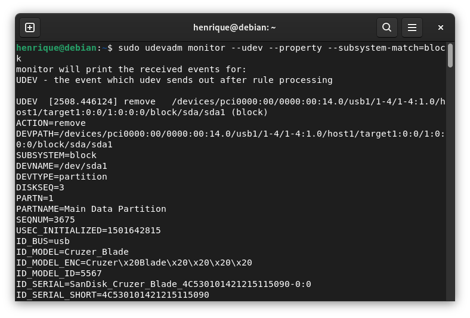

*Figura 13 — Monitoramento de um evento remove da partição USB; as regras do método atuam no disco.*

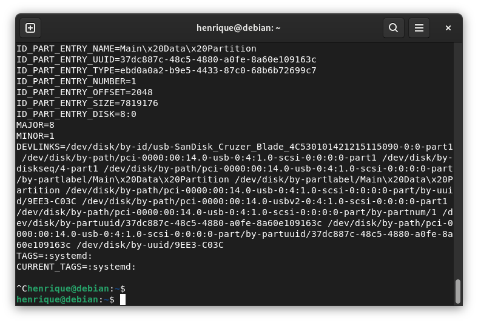

*Figura 14 — Continuação das propriedades exibidas durante o monitoramento.*

Para consultar mensagens recentes do serviço:

```bash
sudo journalctl -u systemd-udevd -b --no-pager -n 100
```


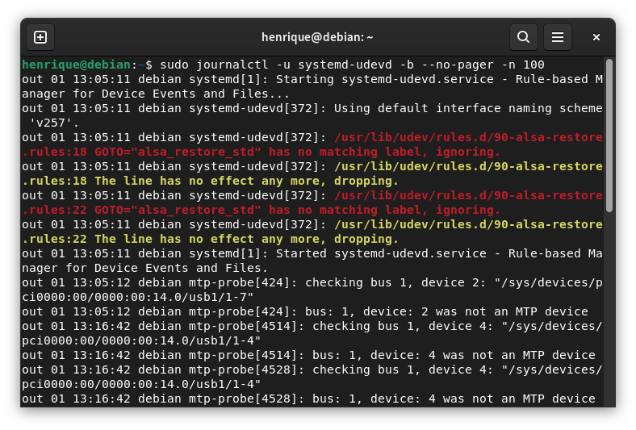

*Figura 15 — Consulta ao journal do systemd-udevd, com mensagens do serviço e de outras regras do sistema.*

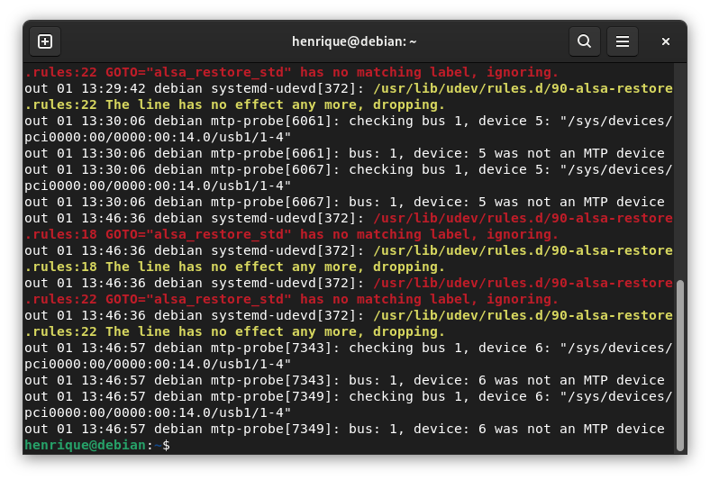

*Figura 16 — Continuação do journal; os avisos visíveis citam a regra 90-alsa-restore.rules.*

Os prints do monitor e do journal documentam a inspeção dos eventos. Não demonstram, por si só, a mudança visual de estado da sessão. Os avisos mostrados citam uma regra de áudio, não o arquivo `80-usb.rules` deste método.

## 10. Desativar ou remover a configuração

Para desativar as regras, preservando uma cópia:

```bash
sudo mv /etc/udev/rules.d/80-usb.rules /etc/udev/rules.d/80-usb.rules.disabled
sudo udevadm control --reload-rules
```

Para reativá-las:

```bash
sudo mv /etc/udev/rules.d/80-usb.rules.disabled /etc/udev/rules.d/80-usb.rules
sudo udevadm control --reload-rules
```


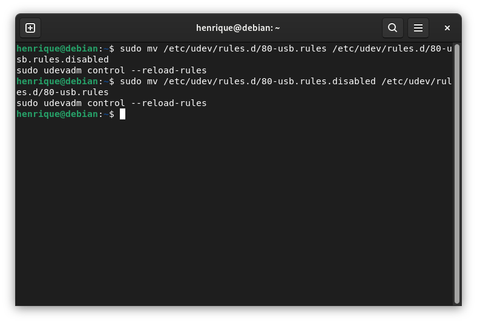

*Figura 17 — Desativação e reativação das regras, com recarga do udev após cada alteração.*

Se desejar remover completamente uma configuração que esteja ativa:

```bash
sudo rm /etc/udev/rules.d/80-usb.rules
sudo udevadm control --reload-rules
sudo rm /usr/local/bin/usb-lock.sh
```

Se as regras já estiverem desativadas, remova o arquivo `.disabled` em vez do arquivo `.rules`.

Essas operações não alteram a senha nem os arquivos PAM. No Método 1 isolado, a senha desbloqueia a tela. Se a Parte 02 estiver ativa, o desbloqueio pelo GDM continua exigindo USB + senha mesmo após remover as regras udev.

## 11. Limitações do método isolado e relação com o método 2

- O método 1 atua somente em sessões existentes; não autentica o login inicial.
- A senha continua permitindo desbloquear a sessão sem o pendrive.
- O bloqueio ocorre no evento de remoção. Este método não monitora continuamente se o pendrive está ausente.
- O serial distingue o dispositivo nas regras, mas não é uma prova criptográfica de identidade e pode ser imitado.
- Reconectar o dispositivo correspondente solicita desbloqueio sem verificar senha ou material criptográfico.
- O funcionamento depende do ambiente gráfico atender aos comandos de `loginctl`.
- A configuração cobre apenas o usuário e o assento especificados no script.

O [Método 02 — Parte 01](../metodo-02/README_USB_Token_Metodo_02_Parte_01.md) implementou USB **ou** senha. A [Parte 02](../metodo-02/README_USB_Token_Metodo_02_Parte_02.md) substituiu essa política por USB **e** senha no GDM e desativou o desbloqueio automático do Método 1.

### Regras na configuração final combinada

```udev
# Desativado na Parte 02: ACTION=="add", SUBSYSTEM=="block", ENV{DEVTYPE}=="disk", ENV{ID_BUS}=="usb", ENV{ID_VENDOR_ID}=="0781", ENV{ID_MODEL_ID}=="5567", ENV{ID_SERIAL_SHORT}=="4C530101421215115090", RUN+="/usr/local/bin/usb-lock.sh unlock"
ACTION=="remove", SUBSYSTEM=="block", ENV{DEVTYPE}=="disk", ENV{ID_BUS}=="usb", ENV{ID_VENDOR_ID}=="0781", ENV{ID_MODEL_ID}=="5567", ENV{ID_SERIAL_SHORT}=="4C530101421215115090", RUN+="/usr/local/bin/usb-lock.sh lock"
```

O script continua instalado e aceita ambas as ações, mas a regra ativa chama somente `lock`. Um administrador ainda pode solicitar desbloqueio via `loginctl`, se o ambiente gráfico atender ao pedido. A autenticação PAM não limita os poderes de root.

As ações usadas por `RUN` devem ser curtas. Não execute agentes permanentes nem comandos que aguardem a reconexão dentro da regra udev. O bloqueio depende do atendimento da solicitação pelo ambiente gráfico; a regra não fiscaliza continuamente a ausência do dispositivo.

## 12. Checklist da implementação validada

- [x] Confirmar Debian 13, GNOME, Wayland e GDM.
- [x] Identificar o usuário e a sessão gráfica.
- [x] Identificar fabricante, modelo e serial do pendrive.
- [x] Testar bloqueio e desbloqueio com `sudo loginctl`.
- [x] Criar script com identificação dinâmica da sessão.
- [x] Configurar proprietário e permissões.
- [x] Verificar a sintaxe e testar o script.
- [x] Criar regras para o disco USB e serial específico.
- [x] Validar e recarregar as regras.
- [x] Testar remoção e reconexão do pendrive.
- [x] Confirmar funcionamento após reinicialização.

## Referências

- [Repositório do projeto](https://github.com/rique-decoder/linux-usb-security-token)
- [Documentação do loginctl](https://www.freedesktop.org/software/systemd/man/latest/loginctl.html)
- [Documentação do udev](https://www.freedesktop.org/software/systemd/man/latest/udev.html)
- [Documentação do udevadm](https://www.freedesktop.org/software/systemd/man/latest/udevadm.html)

Os resultados deste guia correspondem aos testes confirmados pelo usuário durante a configuração do Debian instalado no SSD.
